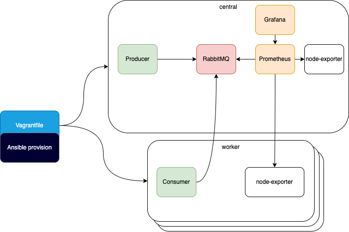

# Test task

## Requirements for running:
- Installed Vagrant
- Installed VirtualBox

---
## Runtime project

> **vagrant up** 

---
## Increase count workers
Need edit Vagrantfile, parametr: 
**COUNT = N** - default "1". Running one worker VM. This Needs it for increase count worker VM.

---
## Access monitoring system
Prometheus:
http://192.168.60.10:9090/

Grafana:
http://192.168.60.10:3000/
>login: admin 
>password: vagrant

---
## Access RabbitMQ UI
RabbitMQ:
http://192.168.60.10:15672/
> login: ansible 
> password: ansible

---

## Application Golang

### Create two Golang applications.
## Producer (application Go)
running ansible
> ./producer -count *'count'*
## Consumer (application Go)
> ./condumer 

---
## Settings for RabbitMQ
Exchange: my-amq 
Queue: my-queue 
Port: 5672

---
## How this working

 
